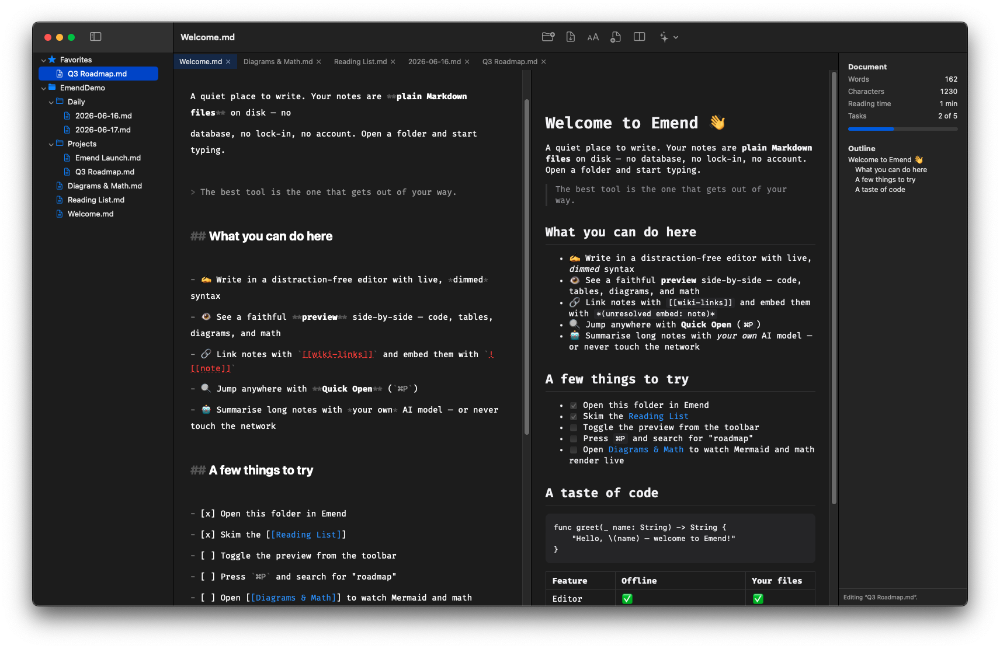
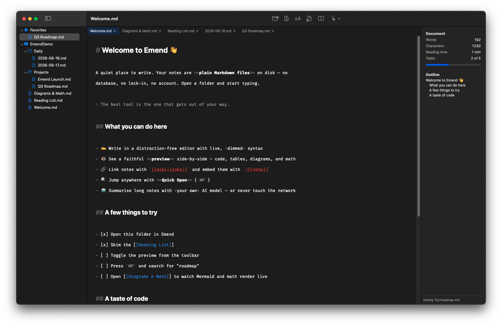
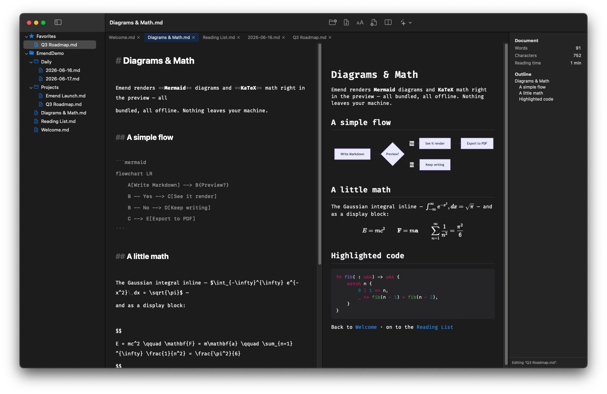
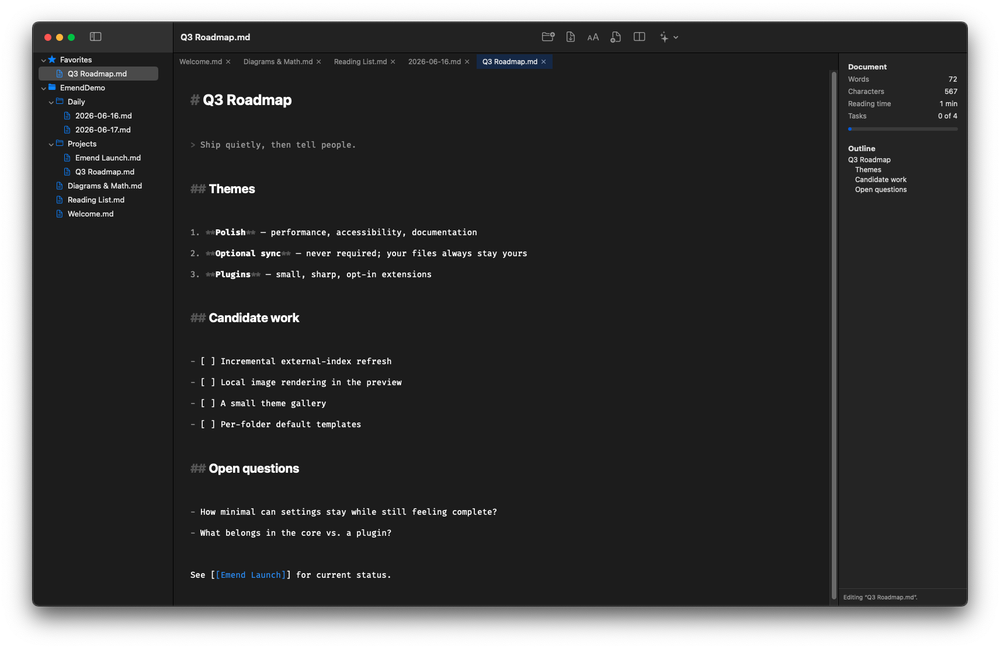
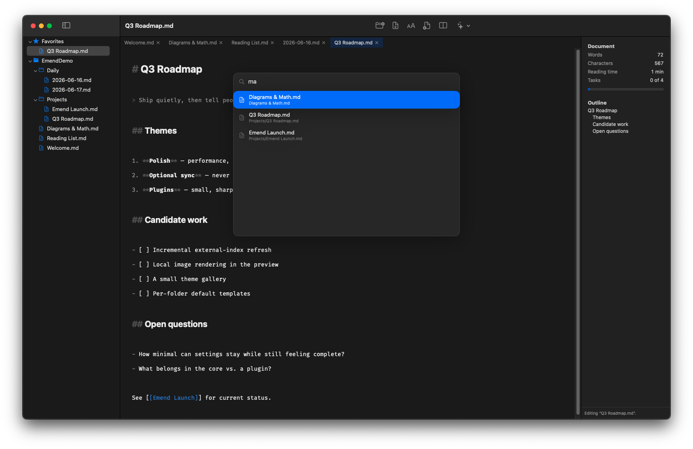
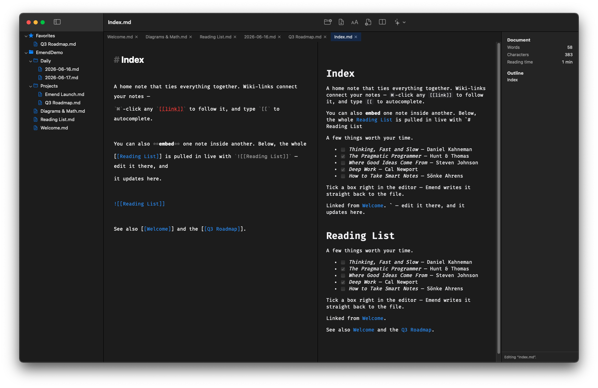
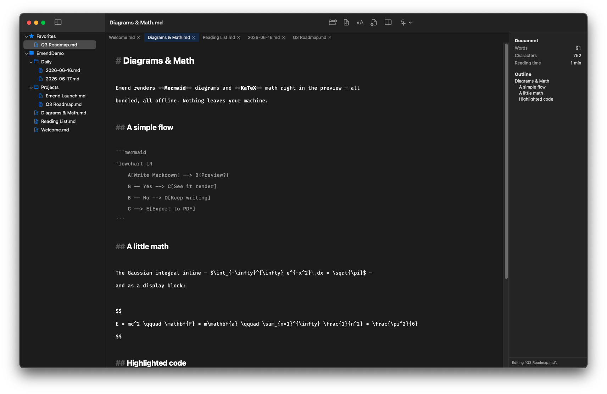
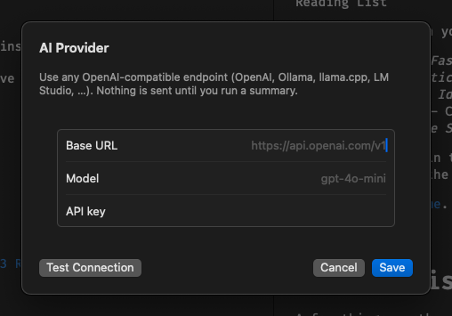
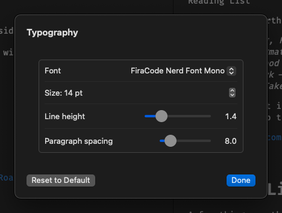

<div align="center">

# Emend

### A quiet, native Markdown editor for macOS

Write in plain files. Preview faithfully. Keep your notes — and your privacy — entirely your own.

[](https://www.apple.com/macos/)
[](#requirements)
[](#how-its-built)
[](LICENSE)
[](#privacy-by-default)



</div>

---

Emend is a calm place to write Markdown on your Mac. It opens a **folder of plain
`.md` files** — no database, no account, no sync you didn't ask for — and gets out
of your way. Type on the left, watch a faithful preview on the right, and link your
notes together into something bigger.

It's a true native app: a Rust core for the heavy lifting, a Swift/SwiftUI interface
that feels like it belongs on macOS, and a hard rule that **nothing leaves your
machine unless you explicitly turn on AI and ask for it.**

## Why you might love it

- 📄 **Your notes are just files.** Open any folder. Edit in Emend, in another app,
  or in your terminal — they're always plain Markdown on disk. Back them up, `grep`
  them, sync them with whatever you already use. No lock-in, ever.
- ⚡️ **Fast and native.** Built for Apple Silicon. Typing stays instant, even in
  big documents; opening, searching, and scrolling feel immediate.
- 👁 **A preview that's actually faithful** — GitHub-flavored Markdown, syntax-highlighted
  code, tables, **Mermaid diagrams**, and **LaTeX math**, all rendered offline.
- 🔗 **Notes that connect.** `[[Wiki-links]]` with autocomplete, `![[embeds]]` that
  inline one note inside another, and clickable task checkboxes.
- 🔍 **Find anything in a keystroke** with Quick Open (`⌘P`).
- 🔒 **Private by default.** Zero network access unless *you* configure an AI model
  and invoke it. Bring your own (any OpenAI-compatible endpoint); your key lives in
  the macOS Keychain and is never logged or stored by the app.
- 🖨 **Export to PDF** that matches what you see.
- 🌗 **Looks right, light or dark** — follows your system appearance automatically,
  with typography you can tune.

---

## Features

### ✍️ Write without friction

A distraction-free editor with **live, dimmed syntax** — your Markdown stays readable
while the markers fade back so the words come forward. Smart lists continue
themselves, formatting shortcuts do the obvious thing, and every keystroke is saved
safely and automatically (atomic, crash-safe writes — you'll never lose work to a
bad moment).

<div align="center">

</div>

### 👁 A preview that keeps up

Toggle a side-by-side preview and watch it render as you type, with synced scrolling
between editor and preview. Code blocks are syntax-highlighted, **Mermaid** diagrams
and **KaTeX** math render inline, and tables, quotes, and lists all look the way you'd
expect — entirely offline, with no remote requests.

<div align="center">

</div>

### 📂 Your files, your folders

Point Emend at a folder and it becomes your workspace — a clean sidebar with your
folder tree, custom folder icons, favorites, and pins. Open notes in tabs. Edit a
file in another app and Emend notices and offers to reload. It's your filesystem,
not a walled garden.

<div align="center">

</div>

### 🔍 Find anything instantly

Press **`⌘P`** for Quick Open: fuzzy search across every note in your workspace,
ranked as you type, with a folder breadcrumb so you always know where you are. Hit
Return to open. It stays fast into the tens of thousands of files.

<div align="center">

</div>

### 🔗 Connect your thinking

Type `[[` and Emend autocompletes links to your other notes. `⌘`-click a link to
follow it. Embed a whole note inside another with `![[Note Name]]`. Tick task
checkboxes right in the editor — Emend writes the change straight back to the file.

<div align="center">

</div>

### 📊 Know your document at a glance

An info pane keeps a live **outline** of your headings (click to jump), plus word and
character counts, reading time, and how many tasks you've completed — all updating as
you write, never getting in the editor's way.

<div align="center">

</div>

### 🤖 AI on your terms

Summarize a long note with **your own model** — Emend talks to any OpenAI-compatible
endpoint you point it at. Summaries stream in and can be cancelled anytime. Nothing
is sent unless you've configured a key *and* asked for a summary. Your API key is
stored only in the macOS Keychain and is never written to disk or logs by Emend.

<div align="center">

</div>

### 🎨 Make it yours

Tune the font, size, line height, and paragraph spacing — applied live to both the
editor and the preview (and to PDF export, so what you print matches what you see).
Light and dark follow your system automatically.

<div align="center">

</div>

---

## Getting started

### Requirements

- **macOS 14 (Sonoma) or later**
- **Apple Silicon** (M1 or newer)

### Install

**Download** — grab the latest build from the
[**Releases**](https://github.com/aaronbassett/emend/releases) page, drag **Emend**
to your Applications folder, and open it.

> On first launch, right-click the app and choose **Open** if macOS asks — it's a
> young project and notarized builds are on the way.

**Or build it yourself** — see [Building from source](#building-from-source) below.

### Your first five minutes

1. **Open a folder.** Click **Add Location** in the toolbar and choose a folder of
   Markdown notes (or an empty folder to start fresh). It appears in the sidebar.
2. **Open a note** from the sidebar — or press **`⌘P`** and start typing a name.
3. **Toggle the preview** with the split-pane button in the toolbar and watch it
   render as you type.
4. **Link two notes:** type `[[` and pick another note from the autocomplete.
5. **Tune the look** from the **Typography** (AA) toolbar button.

That's it — everything you write is saved automatically as plain `.md` files in the
folder you chose.

### Turning on AI (optional)

Emend never talks to the network until you set this up.

1. Open the **AI** menu in the toolbar → **AI Settings…**
2. Enter an **endpoint** (any OpenAI-compatible API), a **model name**, and your
   **API key**. The key is stored in your macOS Keychain.
3. Click **Test Connection**, then use **AI → Summarize Document** on any note.

---

## Keyboard shortcuts

| Shortcut | Action |
| -------- | ------ |
| `⌘P` | Quick Open (fuzzy file search) |
| `⌘B` | Bold |
| `⌘I` | Italic |
| `⌘K` | Insert / wrap link |
| `⌘⇧T` | Toggle task checkbox |
| `[[` | Wiki-link autocomplete |
| `⌘`-click | Follow a wiki-link |
| `⌘Z` / `⇧⌘Z` | Undo / Redo |

Standard macOS editing shortcuts (copy, paste, select-all, and so on) all work as
you'd expect. Lists continue automatically when you press Return.

---

## Privacy by default

Privacy isn't a setting in Emend — it's the starting point.

- **No network access unless you ask.** The only feature that can reach the internet
  is AI summaries, and only after *you* add a key and invoke it. With AI off, Emend
  makes zero outbound connections.
- **The preview is sealed off.** It renders locally with a strict content policy and
  cannot load remote images, scripts, or trackers.
- **Your AI key stays in the Keychain.** It's read only at the moment of a request,
  never written to disk or logs by the app.
- **Your notes never leave your folder.** No telemetry, no analytics, no account.

See the project's [security review](specs/001-markdown-editor/security-review.md) for
the details.

---

## FAQ

**Where are my notes stored?**
Wherever you put them — Emend edits the plain `.md` files in the folder you open. It
never moves them into a hidden database or library.

**Can I use it alongside Obsidian / iCloud / git / Dropbox?**
Yes. Because everything is just files, you can sync or version your notes with
whatever you already use, and edit them in other apps too.

**Do I have to use AI?**
No. It's entirely optional and off until you configure it. Emend is a complete editor
without ever touching the network.

**Does it work offline?**
Completely. Editing, preview (including diagrams and math), search, and PDF export
are all local.

**Is there a Windows or Linux version?**
Not today — Emend is a native macOS app for Apple Silicon.

**What's the catch with "young project"?**
It's at `v0.1.0`. It's solid and well-tested, but expect rough edges and a short list
of [known limitations](#status). Feedback is very welcome.

---

## Status

Emend is at **v0.1.0** — the first complete release. The full, readable history is in
the [CHANGELOG](CHANGELOG.md).

A few known limitations on the roadmap:

- Notes created or deleted *outside* Emend appear in Quick Open after the next
  reindex, not instantly.
- Local images referenced with relative paths don't yet render in the preview.
- Very large (~1 MB+) documents stay editable but syntax highlighting can lag on
  them; typical notes are instant.

---

## Building from source

Emend is a Rust core (`emend-core`) behind a UniFFI boundary, wrapped by a Swift /
SwiftUI app. You'll need **Xcode 16.2+**, **Rust ≥ 1.85**, and a few CLI tools.

```bash
brew install just xcodegen swiftformat swiftlint
rustup component add clippy rustfmt

git clone https://github.com/aaronbassett/emend.git
cd emend

just xcframework   # build the Rust core into an XCFramework + Swift bindings
just xcodeproj     # generate the Xcode project
open app/Emend/Emend.xcodeproj   # then Run (⌘R), or:
just app-test      # build + run the headless test suite
```

The full developer guide — commands, architecture, and conventions — is in
[`specs/001-markdown-editor/quickstart.md`](specs/001-markdown-editor/quickstart.md).

### How it's built

- **Rust core** — all the logic (files, indexing/search, Markdown parsing, the AI
  client) lives in `emend-core`, unit-tested in isolation with no UI dependency.
- **Two Markdown engines, on purpose** — an incremental tree-sitter parser drives the
  editor's live highlighting; [comrak](https://github.com/kivikakk/comrak) produces
  the authoritative preview HTML.
- **Native UI** — TextKit 2 editor, an `NSOutlineView` sidebar, and a sandboxed,
  offline `WKWebView` preview, all in Swift 6 / SwiftUI.

---

## Acknowledgements

Emend stands on excellent open source: [tree-sitter](https://tree-sitter.github.io/),
[comrak](https://github.com/kivikakk/comrak),
[syntect](https://github.com/trishume/syntect),
[KaTeX](https://katex.org/), [Mermaid](https://mermaid.js.org/), and
[UniFFI](https://mozilla.github.io/uniffi-rs/), among others.

## License

[MIT](LICENSE) © Aaron Bassett
