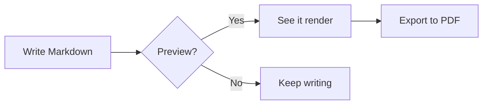

# Diagrams & Math

Emend renders **Mermaid** diagrams and **KaTeX** math right in the preview — all
bundled, all offline. Nothing leaves your machine.

## A simple flow



## A little math

The Gaussian integral inline — $\int_{-\infty}^{\infty} e^{-x^2}\,dx = \sqrt{\pi}$ —
and as a display block:

$$
E = mc^2 \qquad \mathbf{F} = m\mathbf{a} \qquad \sum_{n=1}^{\infty} \frac{1}{n^2} = \frac{\pi^2}{6}
$$

## Highlighted code

```rust
fn fib(n: u64) -> u64 {
    match n {
        0 | 1 => n,
        _ => fib(n - 1) + fib(n - 2),
    }
}
```

Back to [[Welcome]] · on to the [[Reading List]]
